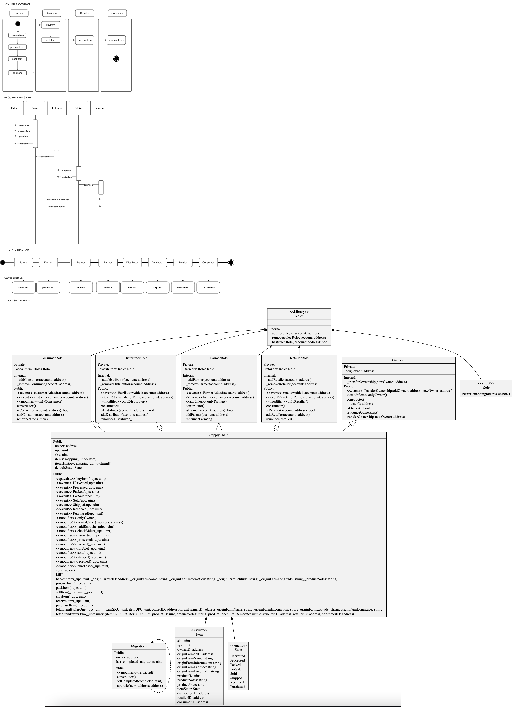

## Versions

Truffle : v5.1.56 (core: 5.1.56)

Node    : v14.15.1

web3    : ^1.3.1

## Diagrams



## Contract

```
0xBCBC37D56D3BA775BdF0320D13250f66F27BEAE1
```
Etherscan link: https://rinkeby.etherscan.io/address/0xBCBC37D56D3BA775BdF0320D13250f66F27BEAE1


## Transactions in Rinkeby

Transaction History

Harvested   - `0x758b9c82010ec9b8badd6358f3008903a3315852203802b1f4f8c9e6e6760176`

Processed   - `0x138f6b6998ea32605db1134c987bfefb934b04c09bf670d0b2041ceca13c7065`

Pack        - `0xa62515bb4558528e394f2cfcf99ce5773cc3c3a71996d4e72ab5fb95aae40ef3`

ForSale     - `0xc218625f7bbac1422a27b0b376be06d4b7f77f81f850299b02215dbcb808d7cf`

Sold        - `0x09effeb0b33d9108ec76dcd1e55340298bd93694b6ca74ee3d3d79296db089d8`

Shipped     - `0x7eabf20623d7fc9428de307a2f82193d4c813250f7df1b30dd73995b9715a062`

Received    - `0x157c2c5b1d485ca4f89ada817b7df1542be6d2ce95fb6dced4460f046f2bbd07`

Purchase    - `0x7f4b72dfe7fb68a1110e10bb7ef0e7d7e21756d8912f6993b11c139379eda1f8`

## Getting Started

These instructions will get you a copy of the project up and running on your local machine for development and testing purposes. See deployment for notes on how to deploy the project on a live system.

### Prerequisites

Please make sure you've already installed ganache-cli, Truffle and enabled MetaMask extension in your browser.

```
Give examples (to be clarified)
```

### Installing

A step by step series of examples that tell you have to get a development env running

Clone this repository:

```
git clone https://github.com/udacity/nd1309/tree/master/course-5/project-6
```

Change directory to ```project-6``` folder and install all requisite npm packages (as listed in ```package.json```):

```
cd project-6
npm install
```

Launch Ganache:

```
ganache-cli -m "spirit supply whale amount human item harsh scare congress discover talent hamster"
```

Your terminal should look something like this:


In a separate terminal window, Compile smart contracts:

```
truffle compile
```

Your terminal should look something like this:


This will create the smart contract artifacts in folder ```build\contracts```.

Migrate smart contracts to the locally running blockchain, ganache-cli:

```
truffle migrate
```

Your terminal should look something like this:


Test smart contracts:

```
truffle test
```

All 10 tests should pass.

Migrate to Rinkbey - Test Network

```
 truffle migrate --reset --network rinkeby
```


In a separate terminal window, launch the DApp:

```
npm run dev
```

## Built With

* [Ethereum](https://www.ethereum.org/) - Ethereum is a decentralized platform that runs smart contracts
* [IPFS](https://ipfs.io/) - IPFS is the Distributed Web | A peer-to-peer hypermedia protocol
to make the web faster, safer, and more open.
* [Truffle Framework](http://truffleframework.com/) - Truffle is the most popular development framework for Ethereum with a mission to make your life a whole lot easier.


## Authors

See also the list of [contributors](https://github.com/your/project/contributors.md) who participated in this project.

## Acknowledgments

* Solidity
* Ganache-cli
* Truffle
* IPFS
